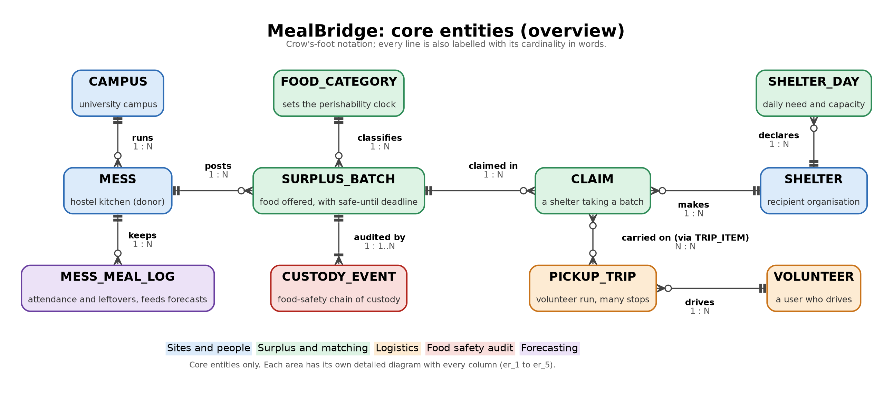

# MealBridge Deliverable 4: Database Design

> **Status:** Draft v2, 5 October 2026. This is course deliverable 4 (build stage 3), now implemented in MySQL in stages 4 and 5: see [`README.md`](README.md) and section 9. The schema in [`sql/01_schema.sql`](sql/01_schema.sql) was executed on **MySQL 8.0.46**: 24 tables, 24 primary keys, 9 unique constraints, 33 foreign keys and 29 CHECK constraints were created without errors. The constraint smoke test output is in section 8.
>
> **Change in v2:** `food_category` gained one column, `values_source`, which records where the safe hours and emission factor came from (default `TO VERIFY: no source cited`). Nothing else in the schema changed.

---

## 1. Data requirements (what the database must remember and guarantee)

**Things to store**

1. Places food moves between: messes (donors) and shelters (recipients), with a geographic location.
2. People who log in, each with one role: mess admin, shelter staff, volunteer, platform admin.
3. Each surplus batch: what food, how much, how it is stored, when it was cooked, and its **safe-until deadline**.
4. Dietary characteristics of each batch and dietary exclusions of each shelter.
5. Each shelter's daily need and capacity.
6. Claims (a shelter taking a batch), with the match score at the moment of claiming.
7. Volunteer pickup trips that visit several messes and shelters in order.
8. A food-safety **chain-of-custody** for every batch (cooked, packed, posted, claimed, picked up, delivered, hygiene checks).
9. Mess history (attendance, menu, prepared, leftover) and the surplus forecasts computed from it.
10. Tunable matching weights, notifications, and a generic change audit.

**Business rules the database itself must enforce** (not the app)

| # | Rule | Enforced by |
|---|---|---|
| R1 | A site is either a mess or a shelter, never both. | Composite FK `(site_id, site_type)` from each subtype (tested, section 8, test T1) |
| R2 | Mess and shelter staff belong to one site; volunteers and admins to none. | CHECK `chk_user_site_by_role` (T2) |
| R3 | Only a mess can post a batch. | FK `surplus_batch.mess_site_id → mess` (T3) |
| R4 | Quantities, temperatures, scores are in valid ranges. | CHECK constraints (T4) |
| R5 | **A batch can have at most one live claim.** | UNIQUE on generated `claim.active_batch_id` (T5, T6), plus row locking in the claim transaction (Stage 4) |
| R6 | A shelter is never allocated more than it can take in a day. | CHECK `chk_sd_reserved` (T7), counter maintained by trigger (Stage 4) |
| R7 | In a trip, a claim is picked up before it is dropped. | CHECK `chk_item_order` |
| R8 | Custody records cannot be edited or deleted, and tampering is detectable. | Trigger + no UPDATE/DELETE grant + SHA-256 hash chain (Stage 4/5) |
| R9 | Expired food is never offered. | `safe_until` + auto-expire event/trigger (Stage 4) |
| R10 | A mess admin's site must be a mess, a shelter user's a shelter; a trip's pickup stop must be the batch's mess. | Triggers (Stage 4), because they span tables |

## 2. ER diagrams

The schema is shown as **one overview plus five area diagrams**, so each picture fits on a slide and no relationship line crosses another. Colours mark the area; a grey dashed box is a table drawn in full in another diagram. Every line uses crow's-foot ends and is also labelled in words (for example `1 : N`).



| Diagram | Shows |
|---|---|
| [er_0_overview](diagrams/er_0_overview.png) | The 11 core entities and how food flows: mess → batch → claim → shelter, with trips, custody and forecasting around it. **Use this one on the poster and first slide.** |
| [er_1_sites_people](diagrams/er_1_sites_people.png) | EER: SITE → MESS / SHELTER (disjoint, total), APP_USER → VOLUNTEER (partial), CAMPUS |
| [er_2_surplus_matching](diagrams/er_2_surplus_matching.png) | Batch, food category, diet tags and exclusions, claim, shelter capacity, scoring weights |
| [er_3_logistics](diagrams/er_3_logistics.png) | Trip, weak entity TRIP_STOP, TRIP_ITEM linking claims to pickup and drop stops |
| [er_4_food_safety_audit](diagrams/er_4_food_safety_audit.png) | Hash-chained custody events and the generic audit log |
| [er_5_forecasting_alerts](diagrams/er_5_forecasting_alerts.png) | Meal log, menu (M:N), forecasts, notifications |

SVG versions sit next to each PNG for sharp printing. All six are generated from [`diagrams/src/build_er.py`](diagrams/src/build_er.py) with Graphviz (`python3 build_er.py`), so they can be regenerated after any schema change. The single all-tables Mermaid diagram is kept as source in [`diagrams/src/er_full.mmd`](diagrams/src/er_full.mmd) for the in-app schema explorer, not for presenting.

## 3. EER features (specialization, weak entity, multivalued attributes)

The specialization circles, the double line for total participation and the weak entity's thick border are drawn in [er_1_sites_people](diagrams/er_1_sites_people.png) and [er_3_logistics](diagrams/er_3_logistics.png).

| EER concept | Where | How it is mapped to tables |
|---|---|---|
| **Disjoint, total specialization** | SITE → {MESS, SHELTER} | One table per class sharing the PK. Each subtype has a *generated* `site_type` column fixed to its own value and a composite FK to `site(site_id, site_type)`. A MESS row therefore cannot reference a SHELTER site (proved in section 8, test T1). "Total" (every site has a subtype row) is guaranteed by `sp_register_site`, which inserts the SITE row and its subtype row in one transaction, because SQL cannot force a child row to exist. |
| **Partial specialization** | APP_USER → VOLUNTEER | Only volunteers have extra attributes, so only they get a `volunteer` row. Mess and shelter staff need no subtype table: their extra fact is just `site_id`. |
| **Shared superclass for locations** | SITE | Lets `trip_stop.site_id` point at *either* a mess or a shelter with one FK, and lets one spatial index serve both. |
| **Weak entity** | TRIP_STOP | No meaning outside its trip; identified by (trip_id, stop_seq); `ON DELETE CASCADE` from the owner. |
| **Multivalued attributes** | batch diet tags, shelter exclusions | Moved to `batch_diet_tag` and `shelter_diet_exclusion` (1NF). The matching rule becomes a clean `NOT EXISTS` subquery. |
| **M:N relationships** | meal service ↔ dish (`mess_menu`), trip ↔ claim (`trip_item`) | Associative tables with composite keys. `trip_item` also carries relationship attributes (pickup and drop stop). |
| **Derived attributes** | meals equivalent (= kg / kg_per_meal), carbon avoided, distance | Not stored; computed in views. Exceptions are the snapshots listed in section 5.4. |

## 4. Key design decisions (be ready to defend these)

1. **Whole-batch claims.** A shelter claims an entire batch. Splitting a batch across shelters would need a quantity ledger and makes the concurrency story much harder to prove. Messes can post a large surplus as several smaller batches instead. *Trade-off:* a shelter that can only take 10 kg cannot claim a 30 kg batch; the match score already penalises that via capacity.
2. **Two layers against double claims.** Layer 1: the claim procedure does `SELECT ... FOR UPDATE` on the batch row inside a transaction and checks `status = 'AVAILABLE'`. Layer 2: even if application code skipped layer 1, the UNIQUE index on `active_batch_id` makes a second live claim impossible (section 8, test T5). MySQL has no partial unique index, so the generated column (batch_id while live, NULL otherwise) emulates `UNIQUE (batch_id) WHERE status IN ('ACTIVE','FULFILLED')`.
3. **Geography in the database.** `POINT SRID 4326` with SPATIAL indexes, so "shelters within the reachable radius" is a database query, not app code. Distance uses `ST_Distance_Sphere` (great-circle). *Limitation to state honestly:* straight-line distance underestimates road distance; the travel-time estimate uses a configurable speed and a detour factor until a routing API is added.
4. **Perishability as data.** Safe hours live in `food_category` per storage mode; the deadline is computed once at posting. The actual hour values must come from food-safety guidance; until they are sourced, each category's `values_source` says TO VERIFY.
5. **Append-only, hash-chained custody log.** Each event stores the previous event's hash; changing any old row breaks every later hash, which a verification query detects.
6. **Weights as data.** Fair-matching weights live in `scoring_weight`, so the platform admin can change policy and the change itself is audited.

## 5. Functional dependencies and normalization

### 5.1 Starting point: the unnormalized "surplus register"

Without a database, a mess would keep one spreadsheet row per donation:

```
DONATION_REGISTER(date, mess_name, mess_block, mess_fssai, campus, campus_city,
                  dishes{...}, category, safe_hours, qty_kg, cooked_at,
                  shelter_name, shelter_phone, shelter_restrictions{...},
                  volunteer_name, volunteer_phone, pickup_time, delivered_time)
```

Problems: `dishes` and `shelter_restrictions` are lists (not atomic); the shelter's phone is repeated on every donation (update anomaly); a shelter cannot be recorded before it receives food (insertion anomaly); deleting the last donation to a shelter loses the shelter (deletion anomaly).

**FDs in the register** (key = {date, mess_name, cooked_at, category}):

- mess_name → mess_block, mess_fssai, campus
- campus → campus_city
- category → safe_hours
- shelter_name → shelter_phone, shelter_restrictions
- volunteer_name → volunteer_phone

### 5.2 Decomposition step by step

| Form | Violation found in the register | Fix | Resulting tables |
|---|---|---|---|
| **1NF** | `dishes{}` and `shelter_restrictions{}` are repeating groups. | Move each list to its own table, one value per row. | `mess_menu`, `batch_diet_tag`, `shelter_diet_exclusion` |
| **2NF** | `mess_name → mess_block, mess_fssai` depends on part of the composite key; so does `category → safe_hours`. | Move partially dependent attributes to tables keyed by the determinant. | `mess` (via `site`), `food_category` |
| **3NF** | `mess_name → campus → campus_city` is transitive; `shelter_name → shelter_phone`, `volunteer_name → volunteer_phone` are non-key determinants. | Give each determinant its own table and keep only an FK. | `campus`, `shelter`, `app_user`/`volunteer` |
| **BCNF** | `trip_stop` early draft had (trip_id, claim_id, stop_type) → site_id, so the stop's site was determined by the claim, not by the stop key. | Stops are keyed by (trip_id, stop_seq) and hold the site; claims are linked to stops through `trip_item`. No attribute depends on anything but a key. | `trip_stop`, `trip_item` |

The donation itself becomes `surplus_batch` (what the mess offers) plus `claim` (who took it), which also removes the insertion anomaly: a batch can exist before anyone claims it.

### 5.3 Per-table check (final schema)

For every table, the only non-trivial FDs are from a candidate key, so each is in **BCNF** (and therefore 3NF). Where a table has more than one candidate key, both are listed: BCNF allows any candidate key on the left side.

| Table | Candidate keys | Non-trivial FDs (all LHS are keys) | Form |
|---|---|---|---|
| campus | campus_id; name | campus_id → name, city | BCNF |
| site | site_id | site_id → all attributes | BCNF |
| mess | site_id; fssai_license_no | site_id → campus_id, hostel_block, mess_type, daily_capacity_meals, fssai_license_no | BCNF |
| shelter | site_id; registration_no | site_id → shelter_type, beneficiary_count, has_refrigeration, default_capacity_kg, registration_no | BCNF |
| diet_tag | tag_code | tag_code → description | BCNF |
| shelter_diet_exclusion, batch_diet_tag | whole row | none (all-key relation) | BCNF |
| app_user | user_id; email | user_id → all | BCNF |
| volunteer | user_id | user_id → all | BCNF |
| food_category | category_id; name | category_id → all | BCNF |
| surplus_batch | batch_id | batch_id → all (see 5.4 on safe_until) | BCNF (see 5.4) |
| shelter_day | (shelter_site_id, day) | key → meals_needed, capacity_kg, reserved_kg | BCNF (see 5.4) |
| claim | claim_id; active_batch_id (when not NULL) | claim_id → all | BCNF (see 5.4) |
| pickup_trip | trip_id | trip_id → all | BCNF |
| trip_stop | (trip_id, stop_seq) | key → site_id, stop_type, times | BCNF |
| trip_item | (trip_id, claim_id) | key → pickup_seq, drop_seq | BCNF |
| custody_event | event_id; row_hash | event_id → all | BCNF |
| menu_item | menu_item_id; name | menu_item_id → name, category_id | BCNF |
| mess_meal_log | (mess_site_id, service_date, meal_slot) | key → headcounts, prepared_kg, leftover_kg | BCNF |
| mess_menu | whole row | none | BCNF |
| surplus_forecast | (mess_site_id, forecast_date, meal_slot, method) | key → predicted_kg, generated_at | BCNF |
| scoring_weight, notification, audit_log | their PK | PK → all | BCNF |


### 5.4 Deliberate, controlled exceptions (and why they are not anomalies)

| Column | Apparent FD | Why it is stored | How it is kept correct |
|---|---|---|---|
| `surplus_batch.safe_until` | {cooked_at, category_id, storage} → safe_until, through `food_category`. Looks transitive. | It is a **historical snapshot**: if the admin later changes a category's safe hours, already-posted batches must keep the deadline they were posted with. Over time the FD does *not* hold, so it is not redundant. It is also the hottest filter column (feed, auto-expire), so it must be indexable; a computed value from another table cannot be indexed. | Set only by a BEFORE INSERT trigger (Stage 4); the app role gets no UPDATE privilege on it. |
| `shelter_day.reserved_kg` | Equals SUM(quantity) of the shelter's live claims that day. Derivable. | A counter cache so that the capacity rule is a **CHECK constraint** evaluated inside the claim transaction under the row lock, instead of a SUM over claims that could race. | Maintained by AFTER INSERT/UPDATE triggers on `claim`; a reconciliation query in Stage 7 tests counter = SUM. |
| `claim.match_score`, `claim.distance_km` | Recomputable from current data. | **Snapshots** for the fairness audit: they record what the system believed when it allowed the claim. Recomputing later would give different answers. | Written once by the claim procedure. |
| `claim.active_batch_id` | (batch_id, status) → active_batch_id | A DBMS-generated column that exists only to enforce rule R5. It can never be inconsistent because MySQL computes it. | `GENERATED ALWAYS ... STORED`. |

## 6. Indexing strategy

InnoDB clusters each table on its primary key and requires an index on every FK column; it creates one automatically if none exists. The indexes below are chosen so that each **named query** uses an index whose leading columns match its equality filters, followed by its range or sort column. Before/after EXPLAIN plans are in [`sql/12_explain_indexes.output.md`](sql/12_explain_indexes.output.md).

| ID | Index | Query it serves | Why these columns, in this order |
|---|---|---|---|
| IDX-1 | `site(location)` SPATIAL | "Shelters within R km of this mess" | R-tree index. The query must use a bounding-box predicate (`MBRContains(ST_Buffer(...), location)`) to use it, then `ST_Distance_Sphere` for the exact cut. A bare distance function in WHERE cannot use any index. |
| IDX-2 | `app_user(site_id)` | Staff of a site; row-level scoping for RBAC | FK, and every dashboard query filters by the user's site. |
| IDX-3 | `volunteer(home_location)` SPATIAL | "Available volunteers near this mess" | Same reasoning as IDX-1. |
| IDX-4 | `surplus_batch(status, safe_until)` | Shelter live feed: `status='AVAILABLE' AND safe_until > NOW() ORDER BY safe_until`; auto-expire job: `status IN (...) AND safe_until <= NOW()` | Equality on `status` first, range on `safe_until` second, so the range is a contiguous slice and the ORDER BY needs no filesort. `status` alone (6 values) is too unselective to index by itself. |
| IDX-5 | `surplus_batch(mess_site_id, created_at)` | Mess dashboard: "my batches, newest first" | Equality then sort column; also serves the FK. |
| IDX-6 | `batch_diet_tag(tag_code)` | Diet suitability `NOT EXISTS` joined through exclusions on tag_code | The PK (batch_id, tag_code) serves lookups by batch; this serves lookups by tag. |
| IDX-7 | `claim(shelter_site_id, claimed_at)` | Fairness: kg received per shelter in the last N days; shelter history | Equality on shelter then range on time; also serves the FK. |
| IDX-8 | `claim(batch_id)` | "Claims for this batch" (custody timeline, history) | The UNIQUE on `active_batch_id` cannot serve this because cancelled claims are NULL there. |
| IDX-9 | `pickup_trip(volunteer_id, status)` | Volunteer app: "my current trip" | Both columns are equality filters. |
| IDX-10 | `trip_stop(site_id)` | "Volunteers arriving at my site today" | FK; PK covers lookups by trip. |
| IDX-11 | `trip_item(claim_id)` | "Which trip carries this claim?" | PK starts with trip_id, so lookups by claim need their own index. |
| IDX-12 | `custody_event(batch_id, event_time)` | Audit timeline for a batch; trigger fetching the batch's last hash | InnoDB appends the PK (event_id) to secondary indexes, so "latest event of batch X" is one backward index dive. |
| IDX-13 | `mess_menu(menu_item_id)` | Forecast feature: average leftover when dish X is served | PK starts with mess_site_id. |
| IDX-14 | `surplus_forecast(forecast_date, meal_slot)` | Today's pre-alerts across all messes | PK starts with mess_site_id, which this query does not filter on. |
| IDX-15 | `notification(user_id, read_at, created_at)` | "My unread notifications, newest first" | `read_at IS NULL` is an equality-like ref on NULL, then sort by time. |
| IDX-16 | `audit_log(table_name, row_pk, changed_at)` | History of one row | Equality, equality, sort. |

Constraint-backed unique indexes (email, FSSAI licence, registration number, row_hash, active_batch_id) also serve lookups by those columns.

**Indexes deliberately not created:** `site(site_type)` and `custody_event(event_type)` alone (too few distinct values to be selective), and any further index on `custody_event` or `audit_log`, which are write-heavy append tables where every extra index slows every insert.

## 7. Relational schema

Full column types and every constraint are in [`sql/01_schema.sql`](sql/01_schema.sql).

| Table | Primary key | Foreign keys | Other columns |
|---|---|---|---|
| CAMPUS | campus_id | (none) | name (unique), city |
| SITE | site_id | (none) | site_type, name, address_line, city, pincode, location, contact_phone, is_active, created_at |
| MESS | site_id | site_id → SITE; campus_id → CAMPUS | site_type = 'MESS', hostel_block, mess_type, daily_capacity_meals, fssai_license_no (unique) |
| SHELTER | site_id | site_id → SITE | site_type = 'SHELTER', shelter_type, registration_no (unique), beneficiary_count, has_refrigeration, default_capacity_kg |
| DIET_TAG | tag_code | (none) | description |
| SHELTER_DIET_EXCLUSION | shelter_site_id, tag_code | shelter_site_id → SHELTER; tag_code → DIET_TAG | (none) |
| APP_USER | user_id | site_id → SITE (empty for volunteers and admins) | full_name, email (unique), phone, password_hash, role, is_active, created_at |
| VOLUNTEER | user_id | user_id → APP_USER | vehicle_type, max_load_kg, home_location, is_available, verified_at |
| FOOD_CATEGORY | category_id | (none) | name (unique), risk_level, safe_hours_ambient, safe_hours_hot_held, safe_hours_chilled, kg_per_meal, co2e_kg_per_kg, values_source |
| SURPLUS_BATCH | batch_id | mess_site_id → MESS; category_id → FOOD_CATEGORY; posted_by → APP_USER | meal_slot, description, quantity_kg, storage, cooked_at, packed_at, safe_until, status, created_at |
| BATCH_DIET_TAG | batch_id, tag_code | batch_id → SURPLUS_BATCH; tag_code → DIET_TAG | (none) |
| SHELTER_DAY | shelter_site_id, day | shelter_site_id → SHELTER | meals_needed, capacity_kg, reserved_kg |
| CLAIM | claim_id | batch_id → SURPLUS_BATCH; shelter_site_id → SHELTER; claimed_by → APP_USER | claimed_at, match_score, distance_km, status, closed_at, close_reason, active_batch_id (unique, generated) |
| PICKUP_TRIP | trip_id | volunteer_id → VOLUNTEER | status, planned_start, started_at, completed_at, planned_distance_km |
| TRIP_STOP | trip_id, stop_seq | trip_id → PICKUP_TRIP; site_id → SITE | stop_type, planned_eta, arrived_at, departed_at |
| TRIP_ITEM | trip_id, claim_id | claim_id → CLAIM; (trip_id, pickup_seq) and (trip_id, drop_seq) → TRIP_STOP | (none) |
| CUSTODY_EVENT | event_id | batch_id → SURPLUS_BATCH; claim_id → CLAIM; trip_id → PICKUP_TRIP; actor_user_id → APP_USER | event_type, event_time, temperature_c, hygiene_ok, notes, location, prev_hash, row_hash (unique) |
| MENU_ITEM | menu_item_id | category_id → FOOD_CATEGORY | name (unique) |
| MESS_MEAL_LOG | mess_site_id, service_date, meal_slot | mess_site_id → MESS | expected_headcount, actual_headcount, prepared_kg, leftover_kg |
| MESS_MENU | mess_site_id, service_date, meal_slot, menu_item_id | (mess_site_id, service_date, meal_slot) → MESS_MEAL_LOG; menu_item_id → MENU_ITEM | (none) |
| SURPLUS_FORECAST | mess_site_id, forecast_date, meal_slot, method | mess_site_id → MESS | predicted_kg, generated_at |
| SCORING_WEIGHT | weight_key | (none) | weight_value, description |
| NOTIFICATION | notification_id | user_id → APP_USER; batch_id → SURPLUS_BATCH | kind, message, created_at, read_at |
| AUDIT_LOG | audit_id | (none) | table_name, row_pk, action, db_user, changed_at, old_values, new_values |

## 8. Verification: the constraints really reject bad data

Script: [`sql/02_constraint_smoke_test.sql`](sql/02_constraint_smoke_test.sql), run with `mysql -uroot --force` on MySQL 8.0.46 using a few synthetic rows. Raw output: [`sql/02_constraint_smoke_test.output.txt`](sql/02_constraint_smoke_test.output.txt).

```
--- T1 EXPECT ERROR: a MESS row pointing at a SHELTER site (disjoint specialization)
ERROR 1452 (23000): Cannot add or update a child row: a foreign key constraint fails
  (`mealbridge`.`mess`, CONSTRAINT `fk_mess_site` FOREIGN KEY (`site_id`, `site_type`) REFERENCES `site` (`site_id`, `site_type`))
--- T2 EXPECT ERROR: a VOLUNTEER user attached to a site
ERROR 3819 (HY000): Check constraint 'chk_user_site_by_role' is violated.
--- T3 EXPECT ERROR: batch posted against a SHELTER site (FK to mess)
ERROR 1452 (23000): ... CONSTRAINT `fk_batch_mess` FOREIGN KEY (`mess_site_id`) REFERENCES `mess` (`site_id`)
--- T4 EXPECT ERROR: negative quantity
ERROR 3819 (HY000): Check constraint 'chk_batch_qty' is violated.
--- T5 EXPECT ERROR: second live claim on the same batch
ERROR 1062 (23000): Duplicate entry '1' for key 'claim.uq_claim_one_live_per_batch'
--- T6 cancel the first claim, then a new claim is allowed
claim_id  batch_id  status     active_batch_id
1         1         CANCELLED  NULL
3         1         ACTIVE     1
--- T7 EXPECT ERROR: shelter reserved beyond its daily capacity
ERROR 3819 (HY000): Check constraint 'chk_sd_reserved' is violated.
--- T8 Nearby-shelter query using the spatial column (km)
name                 km_from_mess
SYNTHETIC Shelter 1  1.96
```

Viva note on T6: the new claim got id 3, not 2, because InnoDB consumed id 2 on the failed insert in T5. AUTO_INCREMENT values are not rolled back, so ids can have gaps; they are identifiers, not counters.

## 9. Implemented in Stages 4 and 5

Every item that this section listed as "carried into Stage 4" is now built and tested. The full guide is [`README.md`](README.md); real output is in the `sql/*.output.*` files.

| Planned here | Implemented as | Real output |
|---|---|---|
| safe_until snapshot, reserved_kg counter, role-to-site check, trip stop check, custody hash chain and append-only guard, generic audit | 18 triggers in [`sql/05_triggers.sql`](sql/05_triggers.sql) | `09_demo_views_procs_triggers.output.md`, T1 to T13 |
| Auto-expire | MySQL EVENT `ev_auto_expire` (every 5 min) calling `sp_expire_batches` | T11 |
| Fair match scoring | `fn_match_score` and five component functions; `sp_rank_shelters` | P1, P2 |
| Claim with `SELECT ... FOR UPDATE` | `sp_claim_batch` | `13_race_demo.output.txt` |
| Trip batching, forecast | `sp_create_trip`, `sp_generate_forecast` | Q4, Q15, Q17 |
| Total specialization of SITE | `sp_register_site` | P3 |
| Feed, impact and fairness views | 8 views in [`sql/06_views.sql`](sql/06_views.sql) | V1 to V5 |
| Synthetic data | [`tools/gen_seed.py`](tools/gen_seed.py), labelled SYNTHETIC | |
| Index before/after | invisible-index EXPLAIN on 200,000 rows | `12_explain_indexes.output.md` |
| Role-based access (R8 grants) | 4 MySQL roles in [`sql/08_roles_grants.sql`](sql/08_roles_grants.sql) | `14_rbac_tests.output.md`, 67 of 67 pass |

Two implementation details differ from what this document assumed:

- The capacity trigger updates `shelter_day` first and inserts only when the day row is missing. `INSERT ... ON DUPLICATE KEY UPDATE` failed, because MySQL checks `chk_sd_reserved` on the row it tries to insert (with default capacity) before it switches to the update.
- Rule R5 is now enforced in three layers, not two: the row lock, a trigger check, and the UNIQUE index. Race 2 of the demo shows the unique index is still needed, because a session that skips the lock passes the trigger check from its old snapshot.

Food-safety hours and `kg_per_meal` remain TO VERIFY. The carbon factor is a single global average (FAO 2013, 3.3 Gt CO2e per 1.6 Gt of food wasted, about 2.06 kg CO2e per kg), also marked TO VERIFY for category-specific use.
